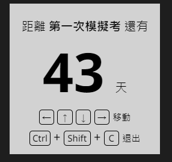

# GSAT-countdown
 
A simple GSAT-countdown gadget.  
Supports Task Scheduler (for Windows).  

## Installation
1. Install NW.js: [https://nwjs.io/](https://nwjs.io/).  
2. Download the latest release `gsat-cd.zip`,  
3. Run `nw gsat-cd.zip` and it should pop up the window.

